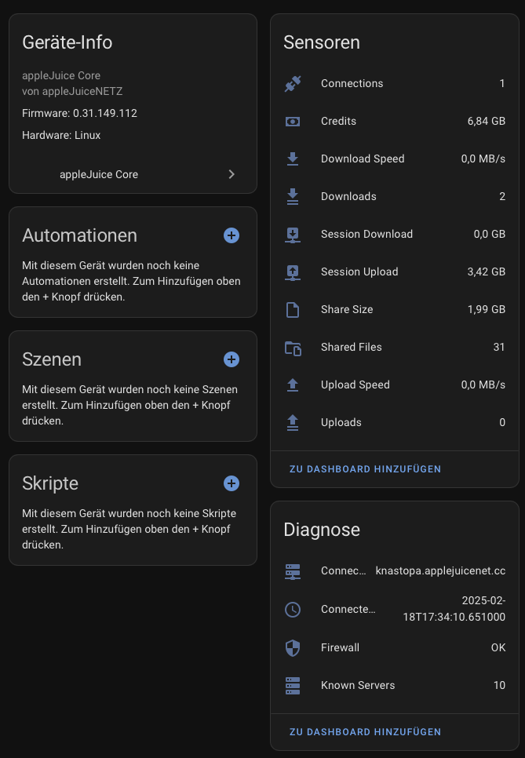

# appleJuice Core für Home Assistant

appleJuice Core Integration für Home Assistant.

## Installation

1. Öffnen [HACS](https://hacs.xyz) in Home Assistant.

2. Klicke auf die drei Punkte in der oberen rechten Ecke und wähle "Benutzerdefinierte Repositories".

3. Füge ein neues benutzerdefiniertes Repository hinzu:

    - **URL:** `https://github.com/applejuicenetz/ha-applejuice-core`

    - **Kategorie:** Integration

4. Klicke auf "Hinzufügen".

5. Klicke die `appleJuice Core` Integration.

6. Klicke auf "HERUNTERLADEN".

7. Navigiere zu "Einstellungen" - "Geräte & Dienste".

8. Klicke auf "INTEGRATION HINZUFÜGEN" und wähle die `appleJuice Core` Integration.

9. Gieb den Host, XMl-Port und dein appleJuice Core Passwort ein und klicke auf "OK".

## Screenshot

