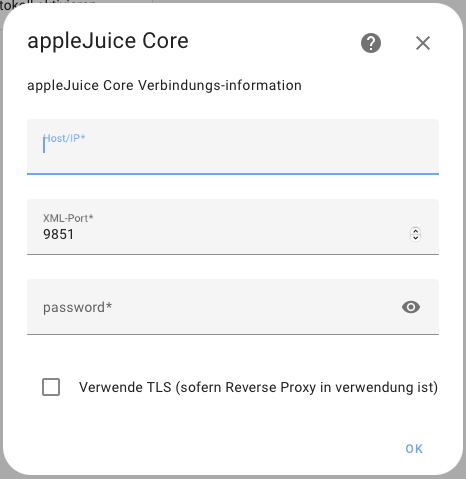
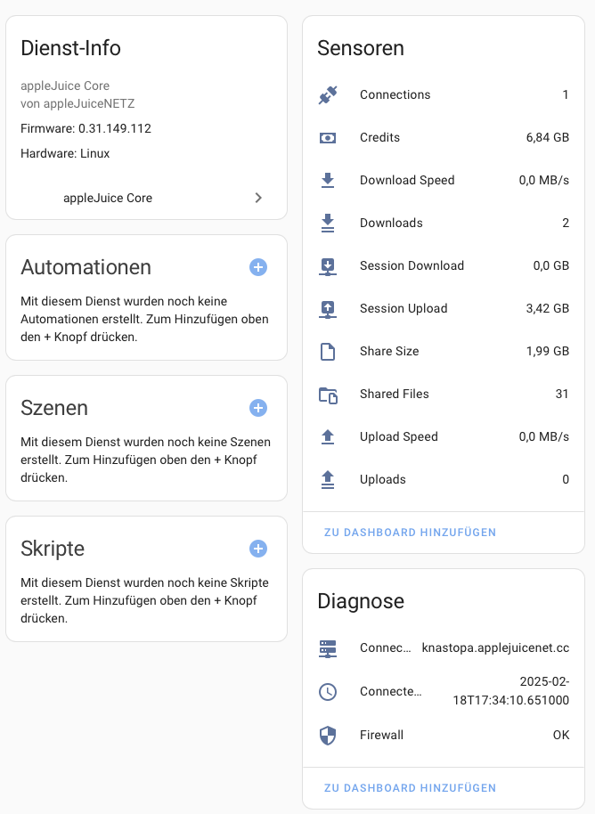
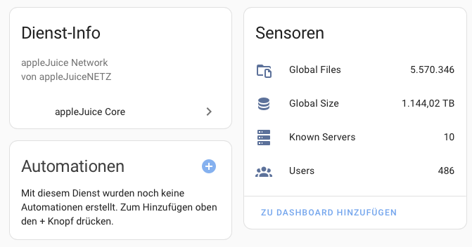

# appleJuice Core Integration für Home Assistant

[](https://github.com/hacs/integration)


appleJuice Core Integration für Home Assistant.

[](https://my.home-assistant.io/redirect/hacs_repository/?owner=applejuicenetz&repository=ha-applejuice-core&category=integration)

## manuelle Installation

1. Öffnen [HACS](https://hacs.xyz) in Home Assistant

2. Klicke auf die drei Punkte in der oberen rechten Ecke und wähle "Benutzerdefinierte Repositories"

3. Füge ein neues benutzerdefiniertes Repository hinzu:

    - **URL:** `https://github.com/applejuicenetz/ha-applejuice-core`

    - **Kategorie:** `Integration`

4. Klicke auf `Hinzufügen`

5. Klicke die `appleJuice Core` Integration

6. Klicke auf `HERUNTERLADEN`

7. starte `Home Assistant` neu

8. Navigiere zu `Einstellungen` - `Geräte & Dienste`

9. Klicke auf `INTEGRATION HINZUFÜGEN` und wähle die `appleJuice Core` Integration

10. Gib `Host/IP`, `XML-Port` und das appleJuice Core `Passwort` ein und klicke auf `OK`

## debugging

in der `configuration.yaml` kannst du das Logging-Level für die `appleJuice Core` Integration anpassen:

```yaml
logger:
  default: warning
  logs:
    custom_components.applejuice_core: debug
```

## Screenshot



